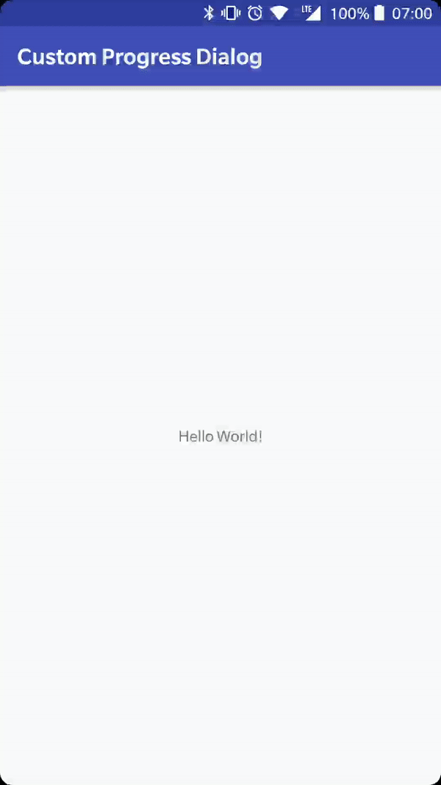

# ProgressDialog
A simple android library to show and hide a ProgressDialog.

<p align="center">
  
</p>

## Gradle

```
repositories {
    ...
    maven { url 'https://jitpack.io' }
}

dependencies {
    ...
    implementation 'com.github.tommasoberlose:progress-dialog:1.0.0'
}
```

## Usage
```kotlin
    ProgressDialogFragment.showProgressBar(this)

    ProgressDialogFragment.hideProgressBar(this)
```

## License
MIT License
